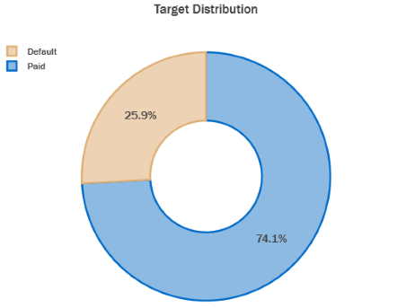
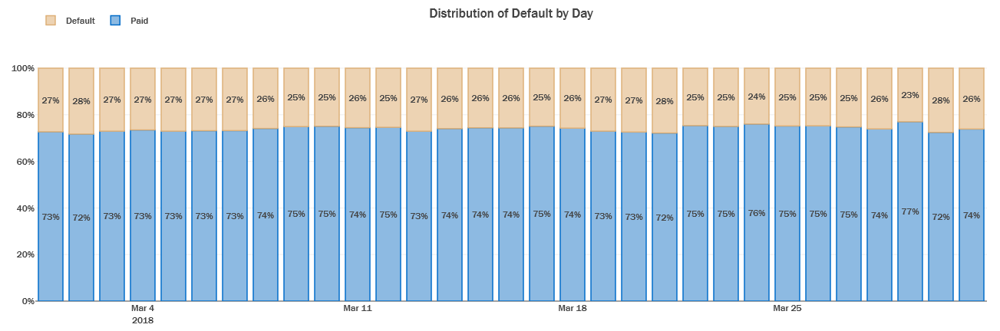
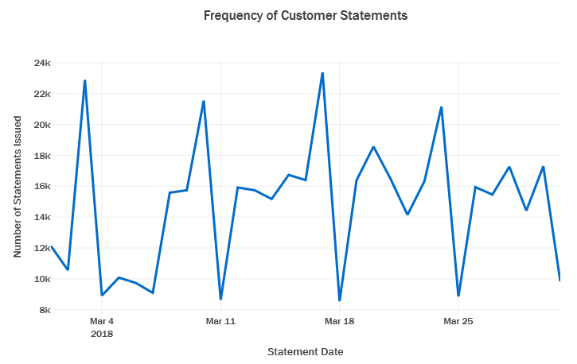
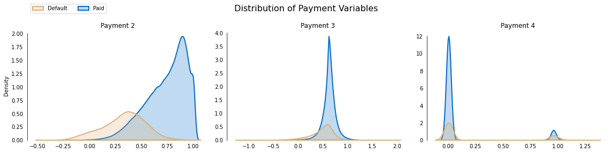
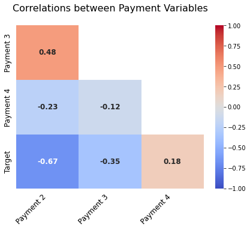

# American Express - Default Prediction


- Built a **classification model** to predict the probability that a customer does not pay back their credit card balance (defaults) based on their monthly customer statements using the data provided by American Express.

- The data was particularly challenging to deal with as it had **5.5 millions records** and **191 annonymized features**. **122 features** had more than **10% missing values**. The target variable had **severe class imbalance**.

- Aggregated existing features over time to engineer new features which helped **increase model accuracy by 12%**.

- **Optimized XGBoost and LightGBM Classifiers using RandomSearchCV** to reach the best model.

- A Soft-Voting Ensemble of the best performing XGBoost and LightGBM Models was used to make final predictions which yielded an **Accuracy of 94.48%, an F1-Score of 96.71% and an ROC-AUC Score of 96.40%.**


## Data

Credit default prediction is central to managing risk in a consumer lending business. Credit default prediction allows lenders to optimize lending decisions, which leads to a better customer experience and sound business economics.


The dataset contains profile features for each customer at each statement date. Features are anonymized and normalized, and fall into the following general categories:

    D_* = Delinquency variables
    S_* = Spend variables
    P_* = Payment variables
    B_* = Balance variables
    R_* = Risk variables

with the following features being categorical:

'B_30', 'B_38', 'D_114', 'D_116', 'D_117', 'D_120', 'D_126', 'D_63', 'D_64', 'D_66', 'D_68'

The dataset can be downloaded from [here](https://www.kaggle.com/competitions/amex-default-prediction).


## Analysis

The complete analysis can be viewed [here](https://nbviewer.org/github/awinml/amex-default-classification/blob/main/amex-eda.ipynb).

### Target Distribution

- In the data present we observe that **25.9% of records have defaulted** on thier credit card payments whereas **74.1% have paid** thier bills on time. 

- This distribution shows us that there is **severe class imbalance** present.
<br><br>



<br><br>

### Distribution of Number of Defaults per day for the first Month:

The **proportion of customers that defualt is consistent across each day** in the data, with a slight **weekly seasonal trend** influenced by the day  when the customers receive their statements.
<br><br>

<br><br>

### Frequency of Customer Statements for the first month:
<br>

<br>

- There is **weekly seasonal trend** observed in the number of statements recieved per day. 
- As seen above this trend does not seem to be significantly affecting the proportion of default.


### Distribution of values of Payment Variables:

<br>

<br>

- We notice that **Payment 2 is heavily negatively skewed (left skewed).** 
- Even though Payment 4 have continuous values between 0 and 1, most of the density is **clustered around 0 and 1**. 
- This tells us that there may be some **Gaussian Noise present**. The noise can be removed and into a binary variable.

### Correlation of Features with Target Variable:

- **Payment 2** is **negatively correlated** with the target with a correlation of **-0.67.**
- **Delinquency 48** is **positively correlated** with the target with a correlation of **0.61.** 

### Correlation of Payment Variables with Target

<br>

<br>

- We observe that Payment 2 and Target are **highly negatively correlated**. 
- This could be probably be due to the fact that people paying their bill have a less chance of default.

## Experiments:

- There is a substantial number of missing values in the data. These cannot be imputed since the features are anonymized and there is no clear rationale behind imputation.
- This constraint forces us to choose models that can handle missing values.
Some of the prominent ones that may be used for classification and accept inputs with missing values are XGBoost, LightGBM, and CatBoost.
- They all internally impute the data depending on whatever imputation technique delivers the greatest performance benefit.

- A baseline was created using a XGBoost model with default hyperparameters which yielded an **Accuracy of 78.84%, an F1-Score of 54.64% and an ROC-AUC Score of 65.72%.**
 
- The LightGBM model with default hyperparameters was tried after that and improved **Accuracy by 1%, F1-Score by 12% and ROC-AUC Score by 6%.**

- A **Randomized Grid Search** with 5 Cross Validation folds was carried out to fine tune the XGBoost and LightGBM models. 

- Hyperparameters of the XGBoost model such as `n_estimators`, `max_depth` and `learning_rate` were tuned to improve **Accuracy by 9%, F1-Score by 18% and ROC-AUC Score by 3%.**

- Hyperparameters of the LightGBM model such as `n_estimators`, `feature_fraction` and `learning_rate` were tuned to improve **Accuracy by 0.1%, F1-Score by 6% and ROC-AUC Score by 10%.**

## Results:

A **Soft Voting Classifier** was used to create a ensemble of both the models and was used for generating the final predictions. It achieved an **Accuracy of 94.48%, an F1-Score of 96.71% and an ROC-AUC Score of 96.40%.**

The results from all the models have been summarized below:

| **Model**                               | **Accuracy** | **F1\-Score** | **ROC\-AUC Score** |
|:---------------------------------------:|:------------:|:-------------:|:------------------:|
| **XGBoost** *\(default\)*               | 78\.84       | 54\.64        | 65\.72             |
| **LightGBM** *\(default\)*              | 79\.84       | 62\.92        | 71\.86             |
| **XGBoost** *\(fine\-tuned\)*           | 88\.61       | 80\.74        | 74\.96             |
| **LightGBM** *\(fine\-tuned\)*          | 88\.72       | 86\.42        | 84\.22             |
| **Voting Classifier** *\(XGB \+ LGBM\)* | **94\.48**   | **96\.72**    | **96\.40**         |

## Run Locally

1. Install required libraries:
      ```bash
        pip install -r requirements.txt 
      ```
2. Generate features:
      ```bash
        python amex-feature-engg.py 
      ```
3. Fine-tune models:
      ```bash
        python amex-fine-tuning.py 
      ```
2. Generate predictions:
      ```bash
        python amex-final-prediction.py 
      ```


## License  &nbsp;&nbsp; [](https://choosealicense.com/licenses/mit/)

Author: [@awinml](https://www.github.com/awinml) 


## Feedback

If you have any feedback, please reach out to me at:  &nbsp; &nbsp; 
<a href="https://www.linkedin.com/in/ashwin-mathur-ds/"></a>

